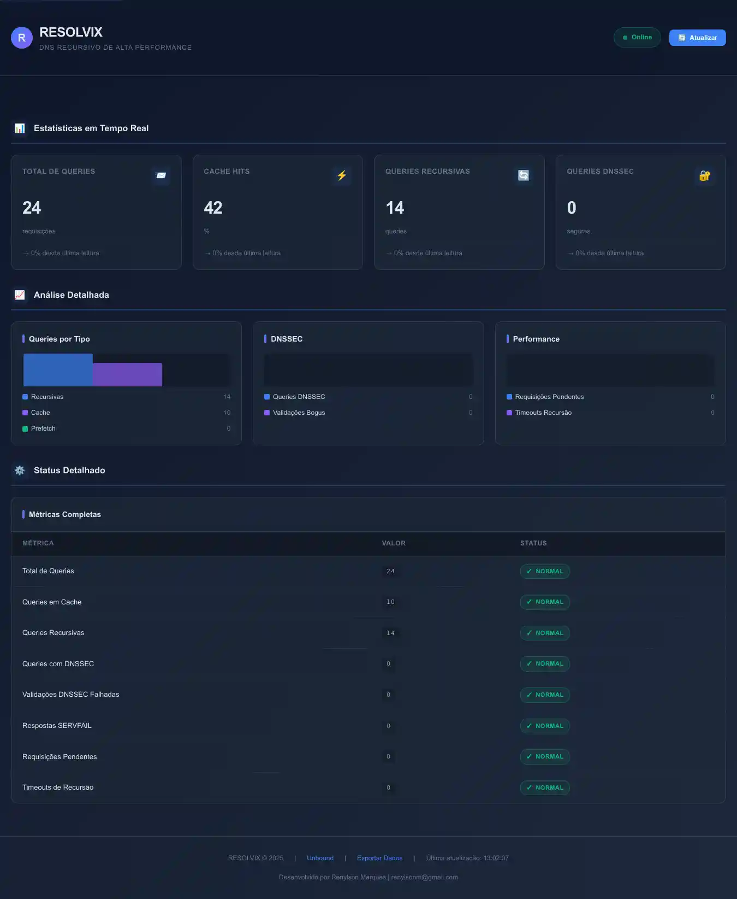

# RESOLVIX - DNS Recursivo de Alta Performance

DNS Recursivo profissional baseado em Unbound com Prometheus para monitoramento.



**Autor:** Renylson Marques  
**Email:** renylsonm@gmail.com  
**Telefone:** (87) 98846-3681

## ✨ Características

- **Unbound v1.22.0**: DNS recursivo de alta performance
- **DNSSEC**: Validação segura de respostas DNS
- **IPv4 + IPv6**: Suporte completo
- **Prometheus**: Monitoramento e coleta de métricas
- **16 Threads**: Otimizado para milhões de requisições por segundo
- **512MB Cache**: Mensagens + RRSET

## 📋 Requisitos

- Debian 13+
- Root access
- Conexão com internet

## 🚀 Instalação

Você precisará está com usuário "root" e instalar o git e clonar no projeto para realizar a instalação.

#### Entrando com usuário root
```bash
su -
```
#### Atualizando e instalado o git
```bash
apt update & apt upgrade -y
apt install git -y
````
#### Clonando o projeto e iniciando instalação do resolvix
```bash
cd /root
git clone https://github.com/renylson/Resolvix-DNS-Server.git
cd /root/resolvix
sudo bash install.sh
```
Agora só seguir com instalação conforme desejar.

**Opções padrão automáticas:**
- Continuar: `s` (sim)
- Modo IP: `2` (Público)
- Versão IP: `2` (IPv4 + IPv6)
- Blocos IP: vazio (IPs privados padrão)
- Prometheus: `s` (sim)
- Confirmação final: `s` (sim)

### Acessar Interfaces

- **Prometheus UI**: http://seu-ip:9090
- **Métricas Unbound**: http://seu-ip:9100/metrics

## 🔐 Configurações de Segurança

### Modo de Operação

- **Uso de IP Local**: Aceita consultas de qualquer origem
- **Uso de IP Público**: Restringe a IPs privados e público conforme lista de blocos liberados.

### IPs Privados Permitidos

- `127.0.0.1` 
- `10.0.0.0/8` 
- `172.16.0.0/12` 
- `192.168.0.0/16` 
- `100.64.0.0/10` 
- `::1`
- `::ffff:0:0/96`

### Blocos Customizados (IPv4 e IPv6)

Durante a instalação, você pode adicionar blocos customizados tantos IPv4 como IPv6 seperados por espaço.

**Exemplos:**
```
203.0.113.0/24 203.0.114.0/24 2001:db8::/32
```

Após instalado e você seja modificar os blocos liberados você pode seguir o procedimentos abaixo:

Editar `/etc/unbound/unbound.conf` para adicionar/modificar:

```
# IPv4
access-control: 203.0.113.0/24 allow
access-control: 203.0.114.0/24 allow

# IPv6
access-control: 2001:db8::/32 allow
access-control: 2001:db9::/32 allow
```

Depois reiniciar:
```bash
systemctl restart unbound
```

## 📚 Comandos Úteis

### Unbound

```bash
# Reiniciar
systemctl restart unbound

# Parar
systemctl stop unbound

# Logs em tempo real
journalctl -u unbound -f

# Verificar configuração
unbound-checkconf

# Recarregar sem reiniciar
unbound-control reload
```

### Prometheus

```bash
# Reiniciar
systemctl restart prometheus

# Parar
systemctl stop prometheus

# Logs
journalctl -u prometheus -f
```

### Exportador

```bash
# Reiniciar
systemctl restart unbound-exporter

# Logs
journalctl -u unbound-exporter -f

# Testar métricas
curl http://127.0.0.1:9100/metrics
```

## 🛠️ Troubleshooting

### DNS não responde

```bash
# Verificar se Unbound está ativo
systemctl is-active unbound

# Ver logs
journalctl -u unbound --no-pager -n 20

# Testar localmente
dig @127.0.0.1 google.com
```

### Porta 53 já em uso

```bash
# Encontrar processo
sudo lsof -i :53

# Se systemd-resolved estiver usando:
sudo systemctl stop systemd-resolved
sudo systemctl mask systemd-resolved
```

### Prometheus não coleta métricas

```bash
# Verificar exportador
curl http://127.0.0.1:9100/health

# Ver métricas
curl http://127.0.0.1:9100/metrics

# Logs do Prometheus
journalctl -u prometheus -f
```

## 📁 Estrutura de Diretórios

```
/etc/unbound/                  # Configuração Unbound
/etc/prometheus/               # Configuração Prometheus
/opt/resolvix/                 # Scripts Resolvix
  ├── unbound_exporter.py      # Exportador Prometheus
  └── ...
/opt/prometheus/               # Binários Prometheus
/var/lib/prometheus/           # Dados Prometheus
/var/lib/unbound/              # Cache Unbound
```

## 🔄 Backup e Restore

### Backup

```bash
# Backup Unbound
cp /etc/unbound/unbound.conf /etc/unbound/unbound.conf.backup.$(date +%Y%m%d)

# Backup Prometheus
tar czf prometheus_backup.tar.gz /etc/prometheus /var/lib/prometheus
```

### Restore

```bash
# Restaurar Unbound
cp /etc/unbound/unbound.conf.backup.YYYYMMDD /etc/unbound/unbound.conf
systemctl restart unbound

# Restaurar Prometheus
tar xzf prometheus_backup.tar.gz -C /
systemctl restart prometheus
```

## 📝 Logs

- **Unbound**: `journalctl -u unbound`
- **Prometheus**: `journalctl -u prometheus`
- **Exportador**: `journalctl -u unbound-exporter`

## 🤝 Suporte

Para mais informações e documentação oficial:

- [Unbound Documentation](https://unbound.docs.nlnetlabs.nl/)
- [Prometheus Documentation](https://prometheus.io/docs/)
- [Repositório RESOLVIX](https://github.com/renylson/resolvix)

## 📄 Licença

Este projeto está licenciado sob a Apache License 2.0 — consulte o arquivo LICENSE para detalhes.

Contribuições são bem-vindas! Para manter a qualidade do código, todas as alterações devem ser enviadas via Pull Request — eu (autor/mantenedor) revisarei e aprovarei as PRs antes do merge para o main.

Ao enviar uma PR, você concorda em licenciar suas contribuições sob a mesma licença do projeto (Apache 2.0). Se preferir um processo formal de contribuição, podemos habilitar um CLA; caso contrário, podemos usar o DCO (Signed-off-by) para commits.

---
