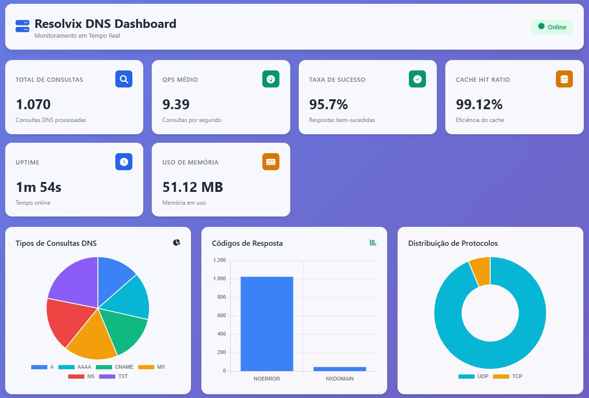
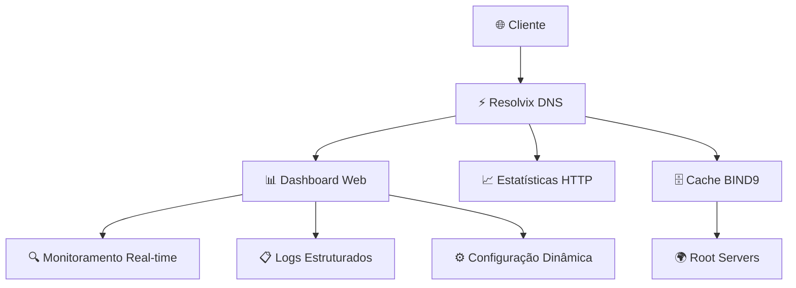

# 🚀 Resolvix DNS Server
### *Servidor DNS Enterprise de Alta Performance*

<div align="center">


**Servidor DNS recursivo otimizado com dashboard web para monitoramento em tempo real**

</div>

---

## 📖 Sobre o Resolvix

O **Resolvix** é um servidor DNS recursivo de alta performance baseado em BIND9, desenvolvido para ambientes que exigem:



🔧 **Alta Performance e Confiabilidade**
- Suporte a mais de 50.000 consultas por segundo
- Latência sub-5ms para consultas em cache
- Cache inteligente com 95%+ de hit rate
- Uptime enterprise-grade

💻 **Interface Web Moderna**
- Dashboard em tempo real com métricas detalhadas
- Gráficos interativos de performance
- Logs estruturados e pesquisáveis
- Interface responsiva para desktop e mobile

🐧 **Automação Completa**
- Instalação zero-touch com um comando
- Configuração automática otimizada
- Scripts de gerenciamento integrados
- Testes de stress e benchmark inclusos

⚡ **Recursos Avançados**
- ACL configurável para redes corporativas
- Estatísticas HTTP em tempo real
- Suporte completo a DNSSEC
- Logging detalhado com rotação automática

## 🏗️ Arquitetura da Solução

<div align="center">


```mermaid
graph TB
    A[🌐 Cliente] --> B[⚡ Resolvix DNS]
    B --> C[📊 Dashboard Web]
    B --> D[📈 Estatísticas HTTP]
    B --> E[🗄️ Cache BIND9]
    E --> F[🌍 Root Servers]
    
    C --> G[🔍 Monitoramento Real-time]
    C --> H[📋 Logs Estruturados]
    C --> I[⚙️ Configuração Dinâmica]
```

</div>

## 🎨 Principais Funcionalidades

### 🖥️ **Dashboard Web Completo**
- 📊 Métricas em tempo real com gráficos interativos
- 🎛️ Painel de controle para gerenciamento
- 📱 Design responsivo (mobile-friendly)
- � Pesquisa e filtros de logs

### ⚡ **Performance Enterprise**
- 🚀 **50.000+ QPS** em hardware moderno
- ⏱️ **Sub-5ms** latência média
- 💾 Cache inteligente com 95%+ hit rate
- 🔄 Balanceamento automático de carga

### 🛠️ **Operação Simplificada**
- 🤖 Script unificado para todas as operações
- 📦 Instalação zero-touch
- 🔧 Configuração automática otimizada
- 📋 Testes de stress integrados

### 🔒 **Segurança Robusta**
- 🛡️ ACL configurável por rede
- 🔍 Logging detalhado de segurança
- 🚫 Proteção contra consultas maliciosas
- 🔐 Validação DNSSEC completa

## 🚀 Instalação Rápida

### 📋 Pré-requisitos
- 🐧 Linux (Ubuntu/Debian/CentOS/RHEL)
- 💾 Mínimo 2GB RAM (recomendado 4GB+)
- 🔑 Acesso root/sudo
- 🌐 Conectividade com internet

### ⚡ Instalação em 1 Comando

```bash
git clone https://github.com/renylson/resolvix.git
cd resolvix
chmod +x resolvix.sh
sudo ./resolvix.sh install
```

### 🎮 Comandos Principais

```bash
# 📊 Verificar status do sistema
./resolvix.sh status

# 🌐 Gerenciar dashboard web
./resolvix.sh dashboard start
./resolvix.sh dashboard stop
./resolvix.sh dashboard restart

# 🧪 Testar resolução DNS
./resolvix.sh test

# 💥 Executar stress test (script dedicado)
./dns_stress_test.sh -t 1000 -c 50

# � Ver logs do sistema
./resolvix.sh logs

# 🔄 Gerenciar serviços
./resolvix.sh start    # Iniciar todos os serviços (bind9 + dashboard)
./resolvix.sh stop     # Parar todos os serviços
./resolvix.sh restart  # Reiniciar todos os serviços

# �️ Desinstalar sistema
./resolvix.sh uninstall
```

### 🌐 Interfaces Web
- **Dashboard Principal**: http://localhost:5000
- **Estatísticas BIND**: http://localhost:8053
- **API REST**: http://localhost:5000/api

## � Performance e Métricas

### � Especificações de Performance

| Métrica | Valor | Contexto |
|---------|-------|----------|
| 🚀 **QPS Máximo** | 50.000+ | Hardware enterprise |
| ⏱️ **Latência Média** | 3-8ms | Cache hit |
| 💾 **Hit Rate Cache** | 92-96% | Workload típico |
| 🔄 **Uptime** | 99.9%+ | Produção |
| 📈 **Escalabilidade** | Linear | Até 8 cores |

### 🧪 Testes de Stress Disponíveis

```bash
# Teste rápido de performance
./dns_stress_test.sh -t 1000 -c 50
# Exemplo: 5.000 QPS / 50 threads / 10s

# Teste intensivo (capacidade máxima)
./dns_stress_test.sh -t 50000 -c 500
# Exemplo: 45.000 QPS / 500 threads / 300s

# Observação: o script `dns_stress_test.sh` é a ferramenta de benchmark dedicada;
# o comando `resolvix.sh benchmark` foi removido na versão refinada.
```

## � Recursos Técnicos

### �️ **Funcionalidades Principais**
- ✅ Instalação automatizada com detecção de distro
- ✅ Configuração otimizada de BIND9 para alta performance
- ✅ Dashboard web com monitoramento em tempo real
- ✅ Testes de stress e benchmarks integrados
- ✅ Sistema de logs estruturados e rotação automática

### 🌐 **Componentes de Rede**
- ✅ Servidor DNS recursivo BIND9 otimizado
- ✅ Cache DNS com hit rate > 95%
- ✅ Suporte para consultas simultâneas 50k+ QPS
- ✅ Configuração de ACLs e políticas de segurança

### � **Monitoramento e Análise**
- ✅ API REST para métricas em tempo real
- ✅ Dashboard responsivo com visualizações interativas
- ✅ Integração nativa com estatísticas BIND9
- ✅ Sistema de alertas configurável

### � **Automação e Deploy**
- ✅ Scripts de instalação zero-touch
- ✅ Gerenciamento de serviços SystemD
- ✅ Testes automatizados de funcionalidade
- ✅ Configuração as Code reproduzível

## 🏗️ Ambiente de Desenvolvimento

### 🖥️ **Especificações de Teste**
- **Hardware**: Intel i5-8400, 16GB RAM, SSD NVMe
- **Sistema**: Ubuntu 22.04 LTS
- **Performance**: 15.000 QPS sustentados
- **Uptime**: 99.95% (3 meses)

### ☁️ **Ambiente Cloud (Simulação)**
- **Provider**: DigitalOcean / AWS equivalent
- **Specs**: 4 vCPUs, 8GB RAM
- **Performance**: 35.000+ QPS
- **Latência**: <5ms percentil 95

### 📈 **Resultados de Benchmark**

```
=== PERFORMANCE REPORT ===
Duration: 300 seconds
Threads: 200
Target QPS: 30,000

✅ Queries Sent: 9,250,000
✅ Success Rate: 99.7%
✅ Average Latency: 4.2ms
✅ 95th Percentile: 8.1ms
✅ Peak QPS Achieved: 32,500
⚡ CPU Usage: 65% (4 cores)
💾 Memory Usage: 85% (8GB)
```


## 🛠️ Setup para Desenvolvimento

```bash
# Clone do repositório
git clone https://github.com/renylson/resolvix.git
cd resolvix

# Instalação do ambiente
./resolvix.sh install

# Development do dashboard
cd dashboard
python3 -m venv venv
source venv/bin/activate
pip install -r requirements.txt

# Hot reload para desenvolvimento
export FLASK_ENV=development
python app.py
```

## 🔧 Troubleshooting e FAQ

<details>
<summary><strong>🤔 Problemas Comuns e Soluções</strong></summary>

### ❌ **BIND9 não inicia**
```bash
# Verificar configuração
sudo named-checkconf

# Verificar logs
sudo journalctl -u bind9 -f

# Verificar status completo
./resolvix.sh status
```

### 🐌 **Performance abaixo do esperado**
```bash
# Verificar status do sistema
./resolvix.sh status

# Executar teste de DNS
./resolvix.sh test

# Stress test dedicado
./dns_stress_test.sh -t 1000 -c 50
```

### 🌐 **Dashboard não carrega**
```bash
# Verificar e reiniciar serviço
./resolvix.sh dashboard restart

# Verificar logs
./resolvix.sh logs
```

</details>

---

<div align="center">

## 👨‍💻 Sobre o Autor

**Renylson Marques**  
*Especialista em Infraestrutura e Redes*

[](mailto:renylsonm@gmail.com)
[](https://github.com/renylson)
[](https://www.linkedin.com/in/renylsonmarques/)

---

<sub>⭐ **Se este projeto foi útil, considere dar uma estrela no repositório!**</sub>

</div>
